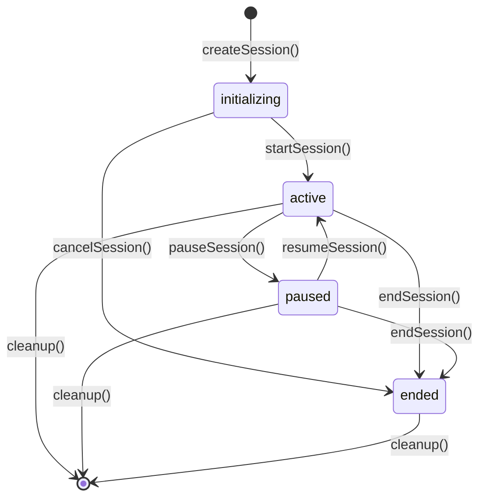
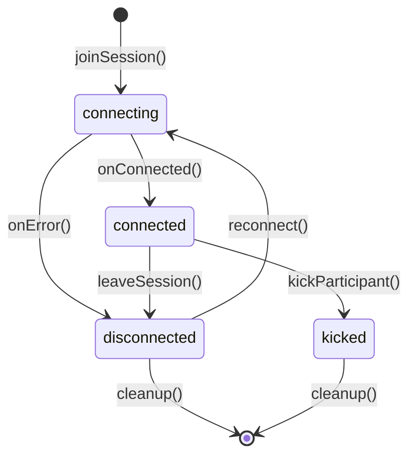

# Comprehensive Data Model - Phase 1

## Core Architecture Principles

This data model implements functional programming patterns using immutable data structures and Either-based error handling. All entities follow domain-driven design principles with clear boundaries and invariants.

## Entity Definitions

### User Entity

**Primary Key**: `id` (CUID format for global uniqueness)

| Field                  | Type           | Constraints                            | Description                      |
| ---------------------- | -------------- | -------------------------------------- | -------------------------------- |
| `id`                   | String         | CUID, Unique, Indexed                  | Unique identifier for the user   |
| `email`                | String         | Unique, Email format, Indexed          | Primary email for authentication |
| `passwordHash`         | String         | Bcrypt hashed, Min length 60 chars     | Securely hashed password         |
| `roles`                | String[]       | Enum: ["user", "broadcaster", "admin"] | User role permissions            |
| `isActive`             | Boolean        | Default: true                          | Account activation status        |
| `emailVerified`        | Boolean        | Default: false                         | Email verification status        |
| `lastLoginAt`          | DateTime?      | Nullable                               | Last successful login timestamp  |
| `loginAttempts`        | Integer        | Default: 0, Max: 5                     | Failed login attempt counter     |
| `lockedUntil`          | DateTime?      | Nullable                               | Account lock expiry timestamp    |
| `createdAt`            | DateTime       | Auto-generated                         | Account creation timestamp       |
| `updatedAt`            | DateTime       | Auto-generated                         | Last modification timestamp      |
| `refreshTokens`        | RefreshToken[] | One-to-Many                            | Associated refresh tokens        |
| `hostedSessions`       | Session[]      | One-to-Many                            | Sessions hosted by user          |
| `participatedSessions` | Participant[]  | One-to-Many                            | Sessions user participated in    |

### Session Entity

**Primary Key**: `id` (CUID format for global uniqueness)

| Field                 | Type          | Constraints                                   | Description                   |
| --------------------- | ------------- | --------------------------------------------- | ----------------------------- |
| `id`                  | String        | CUID, Unique, Indexed                         | Unique session identifier     |
| `type`                | Enum          | ["p2p", "broadcast"]                          | Communication session type    |
| `accessType`          | Enum          | ["public", "private"]                         | Session access control        |
| `passwordHash`        | String?       | Nullable, Bcrypt hashed                       | Password for private sessions |
| `title`               | String        | Max length: 100 chars                         | Human-readable session name   |
| `description`         | String?       | Nullable, Max length: 500 chars               | Session description           |
| `status`              | Enum          | ["initializing", "active", "paused", "ended"] | Current session state         |
| `maxParticipants`     | Integer       | Default: 10, Max: 100                         | Maximum allowed participants  |
| `currentParticipants` | Integer       | Default: 0, Computed                          | Current participant count     |
| `hostId`              | String        | Foreign Key → User.id, Indexed                | Session host user ID          |
| `host`                | User          | Virtual relation                              | Host user object              |
| `participants`        | Participant[] | One-to-Many                                   | Active session participants   |
| `settings`            | Json          | Session-specific configurations               | WebRTC and streaming settings |
| `liveKitRoomId`       | String?       | Nullable, Unique                              | LiveKit room identifier       |
| `startedAt`           | DateTime?     | Nullable                                      | Session start timestamp       |
| `endedAt`             | DateTime?     | Nullable                                      | Session end timestamp         |
| `createdAt`           | DateTime      | Auto-generated                                | Session creation timestamp    |
| `updatedAt`           | DateTime      | Auto-generated                                | Last modification timestamp   |

### Participant Entity

**Primary Key**: `id` (CUID format for global uniqueness)

| Field                  | Type      | Constraints                                           | Description                             |
| ---------------------- | --------- | ----------------------------------------------------- | --------------------------------------- |
| `id`                   | String    | CUID, Unique, Indexed                                 | Unique participant identifier           |
| `sessionId`            | String    | Foreign Key → Session.id, Indexed                     | Associated session ID                   |
| `userId`               | String?   | Nullable, Foreign Key → User.id                       | Associated user ID (null for anonymous) |
| `participantIdentity`  | String    | Unique within session, Indexed                        | LiveKit participant identity            |
| `displayName`          | String    | Max length: 50 chars                                  | Display name in session                 |
| `role`                 | Enum      | ["host", "broadcaster", "viewer", "guest"]            | Participant permissions                 |
| `status`               | Enum      | ["connecting", "connected", "disconnected", "kicked"] | Connection status                       |
| `permissions`          | String[]  | Granular permission flags                             | Specific allowed actions                |
| `joinedAt`             | DateTime  | Auto-generated                                        | Join timestamp                          |
| `leftAt`               | DateTime? | Nullable                                              | Leave timestamp                         |
| `lastActivityAt`       | DateTime  | Auto-generated                                        | Last activity timestamp                 |
| `isAudioEnabled`       | Boolean   | Default: true                                         | Audio stream status                     |
| `isVideoEnabled`       | Boolean   | Default: true                                         | Video stream status                     |
| `isScreenShareEnabled` | Boolean   | Default: false                                        | Screen sharing status                   |
| `connectionQuality`    | Enum?     | Nullable, ["excellent", "good", "poor"]               | WebRTC connection quality               |
| `deviceInfo`           | Json?     | Nullable                                              | Client device information               |
| `ipAddress`            | String?   | Nullable                                              | Participant IP address                  |

### RefreshToken Entity

**Primary Key**: `id` (CUID format for global uniqueness)

| Field        | Type      | Constraints                    | Description              |
| ------------ | --------- | ------------------------------ | ------------------------ |
| `id`         | String    | CUID, Unique, Indexed          | Unique token identifier  |
| `userId`     | String    | Foreign Key → User.id, Indexed | Associated user ID       |
| `tokenHash`  | String    | SHA-256 hashed, Unique         | Secure token hash        |
| `deviceInfo` | Json      | Client device information      | Browser/fingerprint data |
| `ipAddress`  | String    | Participant IP address         | Creation IP address      |
| `isActive`   | Boolean   | Default: true                  | Token validity status    |
| `expiresAt`  | DateTime  | Auto-generated                 | Token expiry timestamp   |
| `lastUsedAt` | DateTime? | Nullable                       | Last usage timestamp     |
| `createdAt`  | DateTime  | Auto-generated                 | Token creation timestamp |

## Relationship Definitions

### Entity Relationships

```typescript
// Functional programming approach using immutable data structures
interface Relationships {
  readonly User: {
    readonly hostedSessions: ReadonlyArray<Session>;
    readonly participatedSessions: ReadonlyArray<Participant>;
    readonly refreshTokens: ReadonlyArray<RefreshToken>;
  };
  readonly Session: {
    readonly host: User;
    readonly participants: ReadonlyArray<Participant>;
  };
  readonly Participant: {
    readonly session: Session;
    readonly user?: User; // Optional for anonymous participants
  };
  readonly RefreshToken: {
    readonly user: User;
  };
}
```

### Cardinality Constraints

- **User ↔ Session (hosted)**: One-to-Many (1 User : 0..\*)
- **User ↔ Participant**: One-to-Many (1 User : 0..\*)
- **User ↔ RefreshToken**: One-to-Many (1 User : 0..5)
- **Session ↔ Participant**: One-to-Many (1 Session : 0..100)
- **Session → User (host)**: Many-to-One (0..\* Sessions : 1 User)

## Comprehensive Validation Rules

### User Entity Validation

```typescript
interface UserValidation {
  readonly email: {
    readonly format: "email";
    readonly unique: true;
    readonly maxLength: 254;
    readonly pattern: "^[A-Za-z0-9+_.-]+@([A-Za-z0-9.-]+\\.[A-Za-z]{2,})$";
  };
  readonly passwordHash: {
    readonly algorithm: "bcrypt";
    readonly strength: 12;
    readonly minLength: 60; // bcrypt hash length
  };
  readonly roles: {
    readonly allowedValues: ["user", "broadcaster", "admin"];
    readonly defaultRole: "user";
  };
  readonly loginAttempts: {
    readonly maxAttempts: 5;
    readonly lockoutDuration: 900000; // 15 minutes in milliseconds
  };
}
```

### Session Entity Validation

```typescript
interface SessionValidation {
  readonly type: {
    readonly allowedValues: ["p2p", "broadcast"];
    readonly defaultValue: "p2p";
  };
  readonly accessType: {
    readonly allowedValues: ["public", "private"];
    readonly defaultValue: "public";
  };
  readonly passwordHash: {
    readonly requiredIf: "accessType === 'private'";
    readonly algorithm: "bcrypt";
    readonly strength: 12;
  };
  readonly title: {
    readonly maxLength: 100;
    readonly minLength: 1;
    readonly pattern: "^[\\w\\s\\p{P}\\p{S}]+$"; // Unicode support
  };
  readonly maxParticipants: {
    readonly minValue: 2;
    readonly maxValue: 100;
    readonly defaultValue: 10;
  };
  readonly status: {
    readonly allowedValues: ["initializing", "active", "paused", "ended"];
    readonly initialValue: "initializing";
    readonly transitions: ReadonlyMap<string, ReadonlyArray<string>>;
  };
}
```

### Participant Entity Validation

```typescript
interface ParticipantValidation {
  readonly role: {
    readonly allowedValues: ["host", "broadcaster", "viewer", "guest"];
    readonly constraints: {
      readonly host: { maxPerSession: 1 };
      readonly broadcaster: { maxPerSession: 10 };
      readonly viewer: { maxPerSession: 100 };
      readonly guest: { maxPerSession: 50 };
    };
  };
  readonly displayName: {
    readonly maxLength: 50;
    readonly minLength: 1;
    readonly pattern: "^[\\w\\s\\p{L}\\p{N}\\p{P}]+$";
  };
  readonly connectionQuality: {
    readonly allowedValues: ["excellent", "good", "poor"];
    readonly defaultValue: "good";
  };
}
```

## State Transition Diagrams

### Session State Machine



### Participant Connection State Machine



## Performance Optimization Indexes

### Database Indexes Strategy

```typescript
interface PerformanceIndexes {
  readonly User: {
    readonly primary: ["id"];
    readonly unique: ["email"];
    readonly compound: [
      ["email", "isActive"],
      ["lastLoginAt", "isActive"],
      ["createdAt", "isActive"]
    ];
    readonly sparse: [
      ["emailVerified"], // Only index verified users
      ["lockedUntil"] // Only index locked accounts
    ];
  };
  readonly Session: {
    readonly primary: ["id"];
    readonly unique: ["liveKitRoomId"];
    readonly compound: [
      ["hostId", "status"],
      ["type", "accessType", "status"],
      ["createdAt", "status"],
      ["startedAt", "status"]
    ];
    readonly partial: [
      ["status = 'active'"], // Only active sessions
      ["accessType = 'public'"] // Only public sessions
    ];
  };
  readonly Participant: {
    readonly primary: ["id"];
    readonly unique: [["sessionId", "participantIdentity"]];
    readonly compound: [
      ["sessionId", "status"],
      ["sessionId", "role"],
      ["userId", "lastActivityAt"],
      ["joinedAt", "status"]
    ];
  };
}
```

## Security Measures and Audit Trails

### Authentication Security

```typescript
interface SecurityMeasures {
  readonly passwordPolicy: {
    readonly minLength: 12;
    readonly requirements: [
      "uppercase",
      "lowercase",
      "numbers",
      "specialCharacters"
    ];
    readonly hashing: {
      readonly algorithm: "bcrypt";
      readonly rounds: 12;
      readonly saltLength: 16;
    };
    readonly history: {
      readonly preventReuse: 5; // Last 5 passwords
      readonly rotationDays: 90; // Force change every 90 days
    };
  };
  readonly jwtTokens: {
    readonly accessToken: {
      readonly expiration: "15m";
      readonly algorithm: "RS256";
      readonly issuer: "pixie-ai-auth";
    };
    readonly refreshToken: {
      readonly expiration: "7d";
      readonly rotation: true; // One-time use
      readonly deviceBinding: true;
    };
  };
  readonly rateLimiting: {
    readonly loginAttempts: {
      readonly windowMs: 900000; // 15 minutes
      readonly maxAttempts: 5;
      readonly blockDuration: 900000; // 15 minutes
    };
    readonly apiRequests: {
      readonly windowMs: 60000; // 1 minute
      readonly maxRequests: 100;
    };
  };
}
```

### Audit Trail Implementation

```typescript
interface AuditTrail {
  readonly events: {
    readonly user: [
      "login_success",
      "login_failure",
      "password_change",
      "role_change",
      "account_lockout",
      "account_unlock"
    ];
    readonly session: [
      "created",
      "started",
      "paused",
      "resumed",
      "ended",
      "participant_joined",
      "participant_left",
      "participant_kicked"
    ];
    readonly security: [
      "token_issued",
      "token_refreshed",
      "token_revoked",
      "permission_denied"
    ];
  };
  readonly metadata: {
    readonly timestamp: "DateTime";
    readonly userId?: "string";
    readonly sessionId?: "string";
    readonly ipAddress: "string";
    readonly userAgent: "string";
    readonly correlationId: "string";
    readonly severity: "info" | "warning" | "error" | "critical";
  };
}
```

## Functional Programming Patterns

### Immutable Data Transformations

```typescript
import { pipe, curry, compose } from "ramda";
import { produce } from "immer";

// Immutable user creation using functional composition
const createUser = (email: string, passwordHash: string, roles: string[]) =>
  pipe(
    (data: Partial<User>) => ({ ...data, id: generateCuid() }),
    (data: Partial<User>) => ({ ...data, createdAt: new Date() }),
    (data: Partial<User>) => ({ ...data, updatedAt: new Date() }),
    (data: Partial<User>) => ({ ...data, isActive: true }),
    (data: Partial<User>) => ({ ...data, loginAttempts: 0 })
  )({ email, passwordHash, roles });

// Immutable state updates using Immer
const updateUserState = produce((draft: UserState) => {
  const user = draft.users[userId];
  if (user) {
    user.lastLoginAt = new Date();
    user.loginAttempts = 0;
    user.lockedUntil = null;
  }
});
```

### Either-based Error Handling

```typescript
import { Either, left, right } from "fp-ts/lib/Either";

// Functional error handling for user operations
const validateUserCredentials = (
  email: string,
  password: string
): Either<ValidationError, ValidatedCredentials> => {
  const errors: string[] = [];

  if (!isValidEmail(email)) {
    errors.push("Invalid email format");
  }

  if (!isValidPassword(password)) {
    errors.push("Password does not meet requirements");
  }

  return errors.length > 0
    ? left({ type: "validation", errors })
    : right({ email, passwordHash: hashPassword(password) });
};

// Compositional error handling
const authenticateUser = compose(
  chain(updateLastLoginTime),
  chain(generateTokens),
  chain(validateUserCredentials)
);
```

## Compliance and Standards

### Data Protection Compliance

- **GDPR Compliance**: Right to erasure, data portability, consent management
- **Data Retention**: User data retained for 7 years, logs for 90 days
- **Encryption**: All PII encrypted at rest using AES-256-GCM
- **Anonymization**: Participant data anonymized after 30 days

### Performance Requirements

- **P2P Latency**: < 200ms average connection time
- **Broadcast Latency**: < 10s for participant synchronization
- **Database Queries**: < 100ms for complex joins
- **Concurrent Users**: Support for 1000+ simultaneous sessions

This comprehensive data model provides a solid foundation for Phase 1 implementation, incorporating all security, performance, and functional programming requirements identified in the research phase.
